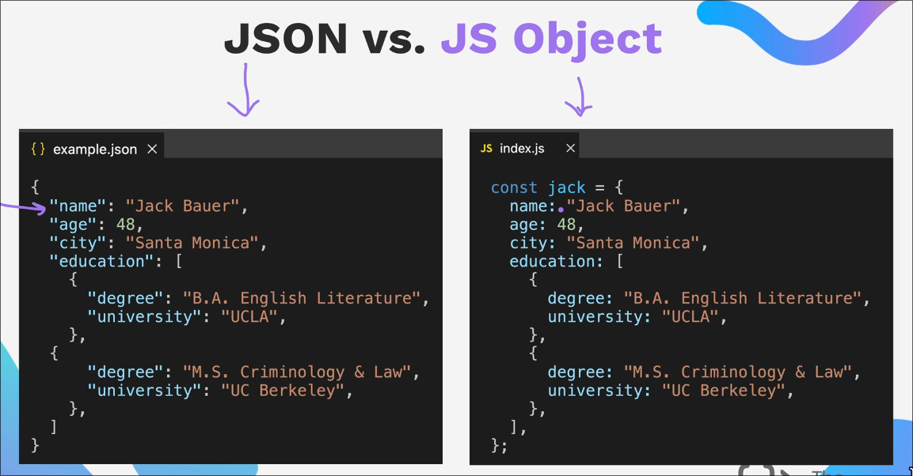

In order to start working with REST APIs or creating one we should first be familiar with JSON files

## JSON vs JS Object



### Packing of JSON

```js
const jsonData = JSON.stringify(data);
```

### Unpacking of JSON

```js
const data = JSON.parse(jsonData);
```

## Sending and Requesting Data

We send and recieve data over the internet and this is usually done over HTTP protocol.
Therefore in order to communicate to a public endpoint we need to use **http** lib can comes with Node.js

## Axios

This is an js lib which makes the process of making these HTTP requests simplar.
Basically in here it's used to communicate with APIs.

### Why is it used over conventional HTTP requests?

Since it's simpler to use for example in order to get data from api endpoint 

- **Using just the http lib**
  Fetching some details
  ```js
  fetch('https://jsonplaceholder.typicode.com/users')
    .then(response => {
      if (!response.ok) {
        throw new Error('Network response was not ok'); // Manual error check
      }
      return response.json();
    })
    .then(data => {
      console.log('Users:', data);
    })
    .catch(error => {
      console.error('Fetch error:', error);
    });

  ```

- **Using Axios**
  ```js
  axios.get('https://jsonplaceholder.typicode.com/users')
    .then(response => {
      console.log('Users:', response.data);  // Directly using the response
    })
    .catch(error => {
      console.error('Axios error:', error);
    });
  ```
  Doing the same with axios has the following benefits
  - Simpler Syntax
  - Does the error handling for you throwing the HTTP codes.


## Using Axios

### Performing with GET Request

```javascript
// Make a request for a user with a given ID
axios.get('/user?ID=12345')
  .then(function (response) {
    // handle success
    console.log(response);
  })
  .catch(function (error) {
    // handle error
    console.log(error);
  })
  .finally(function () {
    // always executed
  });
```

### Using with async/await

```javascript
// Want to use async/await? Add the `async` keyword to your outer function/method.
async function getUser() {
  try {
    const response = await axios.get('/user?ID=12345');
    console.log(response);
  } catch (error) {
    console.error(error);
  }
}
```

### For all other HTTP Requests

```js
// Get
axios.get(url[, config]);
// Delete
axios.delete(url[, config]);
// Patch
axios.patch(url[, data,[ config]]);
// Put
axios.put(url[, data[, config]]);
// Post
axios.post(url[, data[, config]]);

// Square brackets show that these parameters are optional
```

## API authentication

Mainly there are 4 type:

- No Authentication

- Basic Authentication 
  - Passing your username and password with with requests

- API_KEY Authorisation(client who is allowed to use the service 
  whereas authentication is you are considered as user and you log in to something)
  - This is among the common ones that you would come across
  - you might pass it through query parameters or header, so read docs for that particular api.

- Token Based Authentication
  - For example when you authorize a particular account to use your google account.
  > Read more about these since they are much secure way of authentication and you can use it in some great projects 

