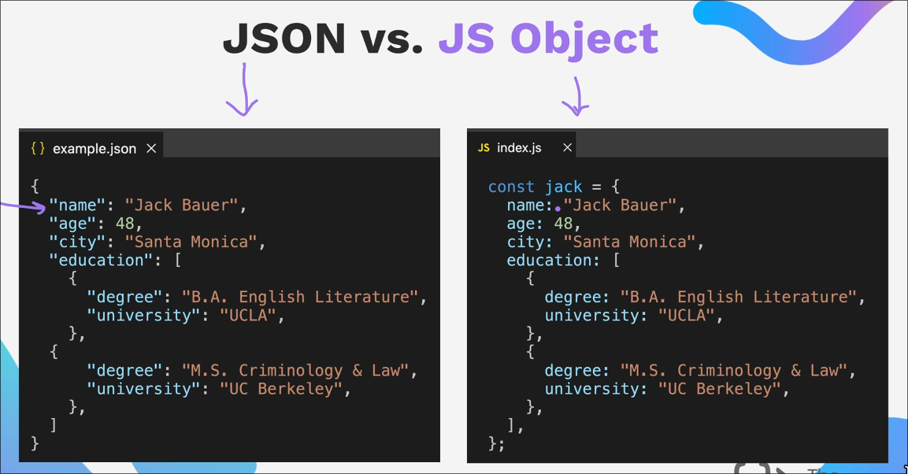

In order to start working with REST APIs or creating one we should first be familiar with JSON files

## JSON vs JS Object



### Packing of JSON

```js
const jsonData = JSON.stringify(data);
```

### Unpacking of JSON

```js
const data = JSON.parse(jsonData);
```