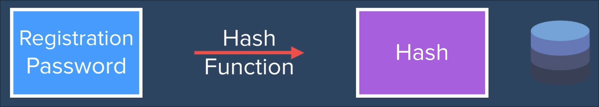

# Level 2: email-password(w/ encryption and hashing)

## Encryption


Different form of encryptions
- Weakest of them all the **CeaserCipher** method
  - Shifting the letter by fixed amount
- **aes256 encryption:** The encryption is done using a string in this case the string used for encryption is TOPSECRET.
Also it's symmetrical in nature.
  

> Since encryptions be it of any form or type is always vulernable to some level of threat that is when Hashing comes into play.

## Hashing


But let's see **how is this works in layman terms?** using an example

Tackle this question 

### **What are the factors of 377 other than 1 and 377?**

You start from one and keep on going from till 183
and once you are done you find the factors are 13 and 29.

Now what if i ask you 

### **What is the multiplication of 13 and 29?**

You directly calculate and say 377. 

> See how going forward was too easy then going backward.

## How we use Hashing in auth?



Then during login we hash the password entered and compare with the hashes present in the db.


## Using bcrypt hashing 

When hashing our password using bcrypt module we use something of this sort.
The callback tells us if there any error or not, and it also return us the hash.

```js
bcrypt.hash(passwordToHash, saltingRounds, async (err, hash) => {
  if(err){
    console.log("Error hashing password");
  } else {
    // db query for saving that password 
  }
} )
```

But when someone is logging in and there entered password is to be check or compared, we can't just hash there pwd again through those salting rounds coz each time they'll get different results.

For tackling this we have got another useful method that is compare.

```js
bcrypt.compare(loginPassword, storedHashedPassword, (err, result) => {
        if (result) {
          // If the result is true redirect the user 
        } else if (err) {
          console.log("Error comparing passwords")
        } else {
          res.send("Incorrect Password");
        }
      })
```