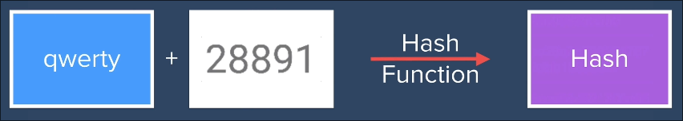
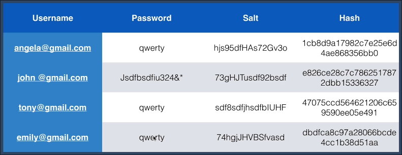

# Authentication 

Here we will be getting on with different levels of authentication and we will be moving step by step so that we get to know about why each level was needed.

## Level 1: email-password(without encryption and hashing)

[Level 1](/AuthNSec/lvl1Auth/)

Email and password are stored in the db in plain text format and checked against plain text in order to login.

## Level 2: email-password(w/ encryption and hashing)

[Level 2](/AuthNSec/lvl2Auth(EncryptionHashing)/readme.md)

### Encryption

The process of converting info or data into code(ciper), in order to prevent unauth access.

### Hashing 

Hash functions are mathematical functions designed to make it almost impossible to go backwards.

## Level 3: Salting 

### Salting in practice

> Now even Salting can sometimes not help attacks against the MD5 hashing, but if we use something else like **bcrypt hashing** **(INDUSTRY STANDARD)** which is much slower than MD5 makes the user password much more secure.

On top of this if you plan on to make it more secure you can use the concept of Salt Rounds.

### Salt Rounds

UserPassword + Salt --> (Hashing) --> HashedPassword 

This is considered as Salting once now if you want 2 salt rounds what you can do is:

HashedPassword + Salt --> (Hashing) --> HashedPassword x2
