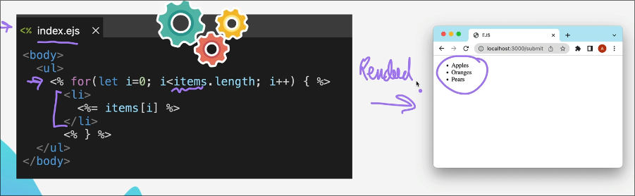
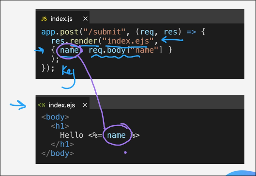

# Embedded JS 

## What is it?

It's a templating language for js, similar to this we have jinja for python etc.

It lets you write HTML templates and embed JavaScript code directly inside those templates.

## Why we need it?

Because `res.send()` or `res.sendFile()` only cater static files so in order to use html code which changes the output the way we want we use it.

For example: 

