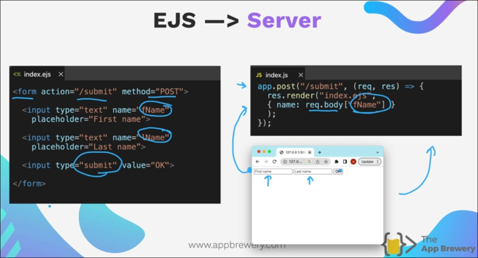

# Embedded JS 

## What is it?

It's a templating language for js, similar to this we have jinja for python etc.

It lets you write HTML templates and embed JavaScript code directly inside those templates.

## Why we need it?

Because `res.send()` or `res.sendFile()` only cater static files so in order to use html code which changes the output the way we want we use it.

For example: 

## EJS Syntax

- Render HTML is used when you want to render HTML inside a block of JS code which is placed in `<%...%>`

- `<%% %%>`: this basically(like escape character for showing `<%` or `%>`) used in scenarios let say you are creating a EJS tutorial website and you want to show `<%` or `%>` seperately

## Passing Data to EJS Templates

Using HTML with EJS:

See how the data is passed passed in the json format and the keys are directly available to us in the .ejs file

Using info provided by the user in .ejs file

