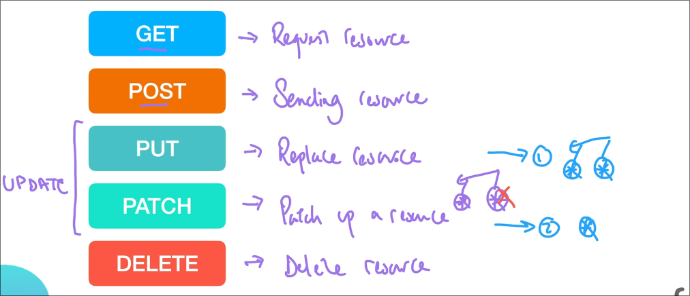

# Basic Stuff

## What is localhost?

When we don't have a server on the internet and instead we host our server locally.

## What is Port?

Port can be understood as different doors to our servers.
So when we listen through that port or we say this port is open, we basically mean that we are looking through that door or waiting for some info through that door so that we can access it respectively.

# HTTP Requests

