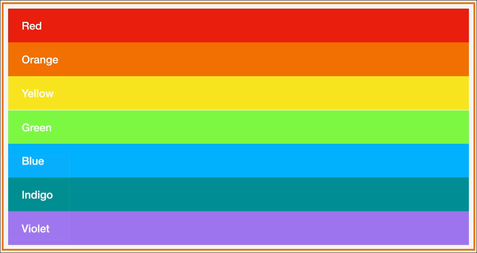

# Getting Started with Flexbox

first set `display: flex`

> A complete guide to flexbox: [CSS-Tricks](https://css-tricks.com/snippets/css/a-guide-to-flexbox/)

## Properties

### flex-direction

- `flex-direction: row`

- `flex-direction: column`


### flex-basis 

- Depending upon the main axis it increases the width or height.
- So if `flex-direction: row` then flex-basis increases the width
- And if `flex-direction: column` then flex-basis increases the height.

### gap

- Lets us have gap between the other elements of the parent element when the parent element is set to `display: flex`

## Some imp points to consider 

- When we set the display property of a block to **flex**, the block actually don't follow the rules set by other display properties like:
    - inline
    - inline-block
    - block

## Flex Layout

Properties responsible for the layout are:

- order (set on child)
- flex-wrap: (set on parent)
    - wrap
    - nowrap
- justify-content: (on parent)
    - flex-start (to left)
    - flex-end (to right)
    - center (horizontally center)
- align-items: (on parent)
    - flex-start (to top according to the height)
    - flex-end (to bottom)
    - center (vertically center)
- align-self: (on particular child)
    - same as above

## Flex Sizing

Following the order from right to left:


### flex-grow and shrink

Allows to set if we allow our content to grow or shrink.
Example:

```css
flex-basis: 0;
flex-grow: 1;
flex-shrink: 1;

/* To write this in short hand notation we can do  */
flex: 1 1 0;
/* Furthermore it can be shortened to */
flex: 1;
```
