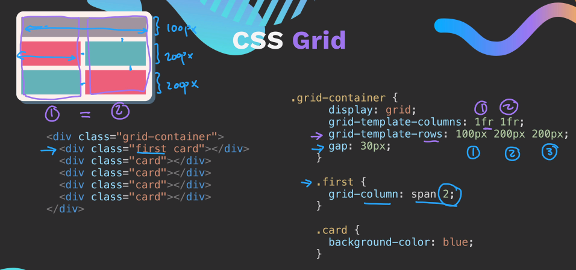
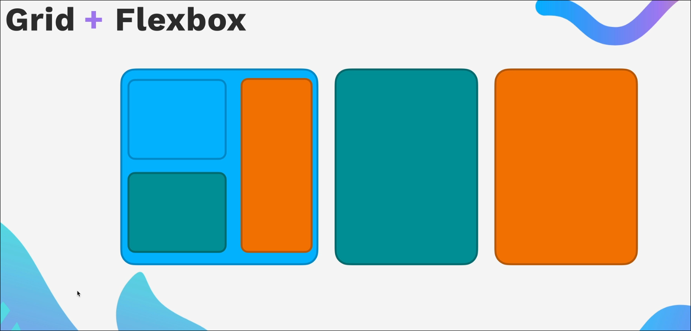

# An Overview of Grid

So one thing to note is that we use grid when we need to create 2D layouts as the one shown in the picture above.

If we have knowledge about both flexbox and grid then we might ask **which is better** flexbox or grid.

> The answer is simple: Flexbox for 1D and Grid for 2D

Basically when creating a layout a webdev uses a combination of both we'll see that in our personal website that we will create.

