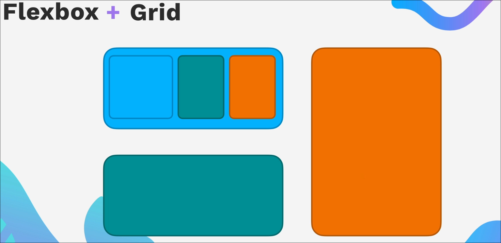
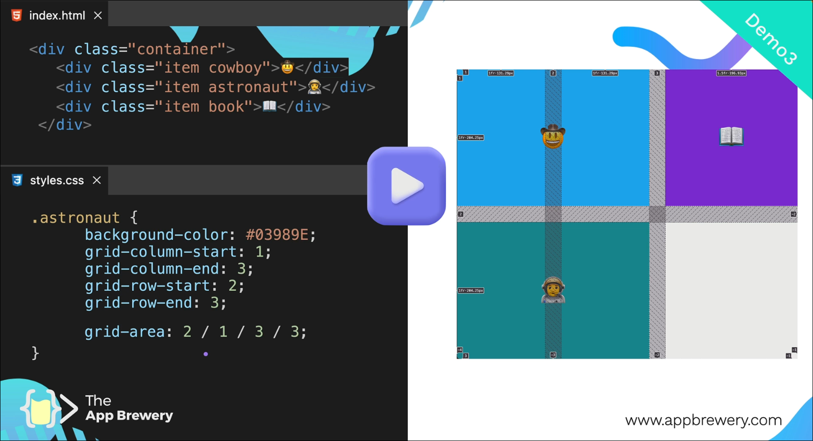

# An Overview of Grid

Full cheatsheet for grid can be acessed at: [CSS-Tricks](https://css-tricks.com/snippets/css/complete-guide-grid/)


So one thing to note is that we use grid when we need to create 2D layouts as the one shown in the picture above.

If we have knowledge about both flexbox and grid then we might ask **which is better** flexbox or grid.

> The answer is simple: Flexbox for 1D and Grid for 2D

Basically when creating a layout a webdev uses a combination of both we'll see that in our personal website that we will create.



## Grid Sizing 

As we have already seen how to template the grid columns and rows a **short notation** for this would be:


### Types of sizing in grid 

- fixed
- auto
- fractional
- minmax
- repeat
    - used when we want to repeat a certain size n times
    - For eg: in our previous chess board we wrote 1fr 8 times like an idiot instead what we could have done was.
    - `grid-template-columns: repeat(8, 1fr)`

### grid-auto-rows

What this does is if we have something where new divs will be created and added to the grid then for those extra divs we can have fixed height using `grid-auto-rows`.

For columns the new div automatically takes the column width of the above divs.

## Grid Placement

One way to set how much rows or column an element covers is span by:

```css
grid-column: span 2;
grid-row: span 3;
```

Other one is to use the property start and end, 

- `grid-column-start: 1;`
- `grid-column-end: 3;`

What this will do is start the particular element from 1st column and extend till 3, basically make the element cover 2 columns(or give it a span of 2).

> Also remember with order it's always relative to other elements.

### Short notation i.e. `grid-area`



> If you are using grid-area for one element you should also use grid-area for other elements as well to avoid any unecessary issues.