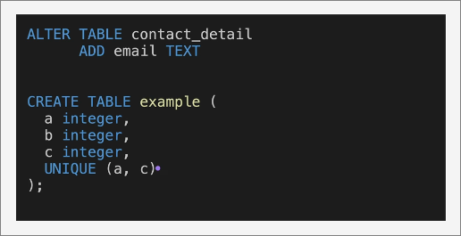

# ALTER

## ALTER TABLE

`UNIQUE(a, c)` makes sure that (a, c) is unique 
  - Example we can't have entries like (2, 1, 1) and (2, 2, 1) since (a, c) = (2, 1) is already present and adding it will violate our unique constraint.

# UPDATE 

When we want to update a particular piece of data rather than altering table properties we use UPDATE

For Example: 

Updating a specific column where some_condition.

> Note once again that adding WHERE constraints is very important otherwise the change will happen on all the rows of the table

# ORDER BY

As the name suggests it helps to fetch records in the asked order.

For example: 

The image below shows that we can order things by a specific column.

# DELETE

As the name suggests it's for deleting records with specified constraints.

