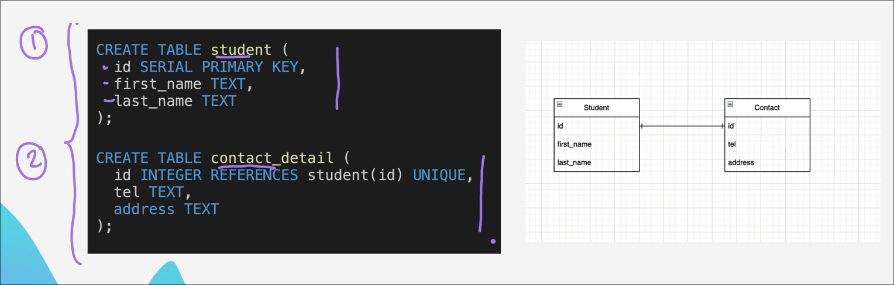
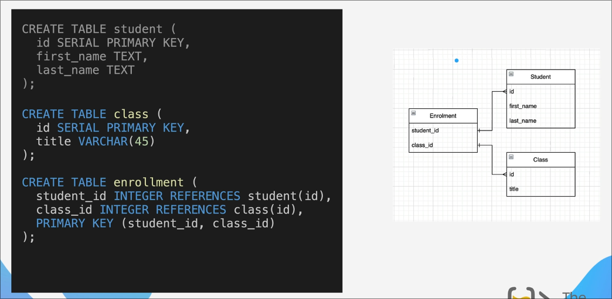

# Relationship Types

- One to Many
- One to One 
- Many to Many

## One to One

## Many to One or One to Many 

This is used in the scenarios like

- A student has to make multiple homework submission and each submission
is supposed to be a different table.

- An author with several different books

Now the type of relation is described as from what perspective are you viewing it.
Say if you view it from students table to HW table then it's One to Many, 
but if you see from HW tables it'll be Many to One

## Many to Many

A many-to-many relationship happens when:
- Multiple records in Table A can be related to multiple records in Table B
- AND multiple records in Table B can be related to multiple records in Table A

Example as shown in the fig
- Student and Classes
  - A student can take many different classes 
  - A class can have many different students 

> This is usually achieved by creating a seperate 

