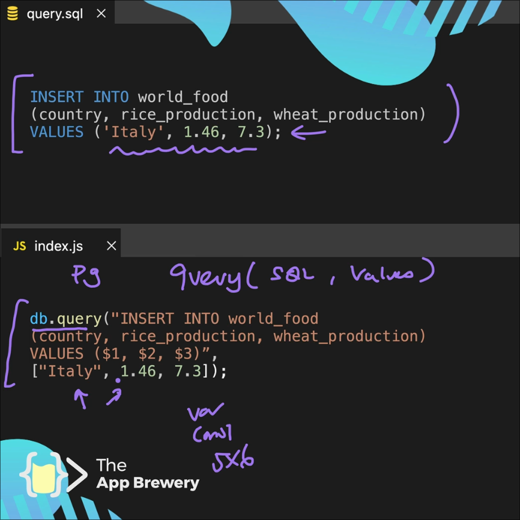

# Imp things to learn from this tracker

## Usage of async functions

So when we are making `db.query()` calls to our database and either **fetching or inserting** records
we need to keep in mind that the section/function doing that part **should use async and await**.

The reason behind this is that running the index.js file directly without including these promises, 
all the code would run at the same time and then the execution of db.query() will complete afterwards leaving gaps 
in our program execution here's an example from our tracker which keeps this in mind:

```js
//  A function which inserts the visited country to out visited_country table
async function insertVisitedCountry(countryCode) {
  try {
    const result = db.query("INSERT INTO visited_countries (country_code) VALUES ($1)",
      [countryCode]
    )
    console.log("Country Added successfully");
  } catch (error) {
    console.log("Error inserting record: ", error);
  }
}

// A function which fetches the country code for that country to be added in our visited_country table
async function getCountryCode(countryName) {
  const result = await db.query("SELECT country_code FROM countries WHERE country_name = $1", [countryName]);

  let countryCode = result.rows[0].country_code;
  console.log(countryCode);
  return countryCode;
}

app.post("/add", async (req, res) => {
  // fetch the country code for the entered country

  // await below makes sure that the value of this variable is 
  // only updated when getCountryCode() fn completes it execution
  const countryCode = await getCountryCode(req.body.country)
  console.log("CountryCode: ", countryCode)

  // insert the country code
  insertVisitedCountry(countryCode);

  // rendering index.ejs again
  res.redirect("/");
})
```
 
## Constraints


## How we add data to our db using pg module

