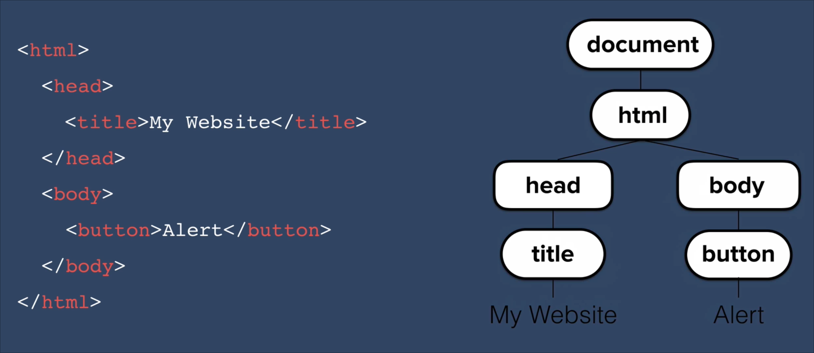

# Adding JS to our websites

## Ways of add the script

- **Inline**: in the html file itself
  > One thing to note is that when using double quotes you might face error like the whole thing being interpreted as string, to avoid this use single quotes instead.
  - Example: `<body onload="alert('Hello')">`
  - Don't use this is not a good way of using js.

- **Using `<script></script>` tag**: The js inside the tag is executed when it runs

- **External file**: `<script src="/link/to/js/file"></script>` 

## Where to place the script tag

The position matters quite a lot. As the browser runs the code from top to bottom we need to place js in correct page.

Since let say you keep the script tag in the top like css, and in the script.js file you try to to change some html element which is not yet created it will throw an error.

> So the best practice is to keep the script at the end of the body tag

# DOM(Document Object Model)

The DOM provides a structured, hierarchical representation of the document as a tree of objects. Like this,



## Working with DOM in JS:

### Accessing Elements

- `document.getElementById(id)`: Returns element with the specified id.
- `document.getElementsByClassName(className)`: Returns all elements with the specified class.
- `document.getElementsByTagName(tagName)`: Returns all elements with the specified tag name.
- `document.querySelector(selector)`: Returns the first element matching the CSS selector.
- `document.querySelectorAll(selector)`: Returns all elements matching the CSS selector.

### Manipulating Elements

- **Text Content:** Change the text inside an element.
  - `element.textContent = 'New Text';`
- **HTML Content:** Change the HTML inside an element.
  - `element.innerHTML = '<span>New HTML</span>';`
- **Attributes:** Get or set attributes like src, href, etc.
  - `element.setAttribute('src', 'image.jpg');`
  - `element.getAttribute('href');`
- **CSS Styles:** Modify inline styles.
  - `element.style.backgroundColor = 'red';`
  - For other properties check: [link](https://www.w3schools.com/jsref/dom_obj_style.asp)

### Add/Remove classes to an element

- **Adding Class**
  ```js
  const btnClassList = document.querySelector("button").classList;
  btnClassList.add("invisible");
  ```
- **Remove Class**
  ```js
  const btnClassList = document.querySelector("button").classList;
  btnClassList.remove("invisible");
  ```
- **Another useful method is Toggle**\
  What `.toggle("invisible")` does is it add the class if it's not present and removes if present.

### Adding/Removing Elements

- **Create an element**
  ```js
  const newDiv = document.createElement('div');
  newDiv.textContent = 'This is a new div!';
  document.body.appendChild(newDiv); // Adds to the end of the body
  ```

- **Remove an element**
  ```js
  const oldDiv = document.querySelector('#oldDiv');
  oldDiv.remove(); // Removes the element from the DOM
  ```

- **Insert a new element before another**
  ```js
  const referenceNode = document.querySelector('#existingElement');
  document.body.insertBefore(newDiv, referenceNode); // Inserts newDiv before existingElement
  ```

### Event Handling

Listening for events like click, form submissions, etc., and respond accordingly 

- **Add Event Listner**
  ```js
  const button = document.querySelector('button');
  button.addEventListener('click', function() {
    alert('Button clicked!');
  });
  ```

- **Remove Event Listner**
  ```js
  const handler = function() {
    alert('Button clicked!');
  };
  button.addEventListener('click', handler);
  button.removeEventListener('click', handler);
  ```

### Traversing DOM

You can also navigate through DOM

- **Parent Element:**
  ```js
  const childElement = document.querySelector('.child');
  const parentElement = childElement.parentElement;
  ```

- **Child Element:**
  ```js
  const parentElement = document.querySelector('.parent');
  const children = parentElement.children;
  ```

- **Next/Prev Sibling:**
  ```js
  const currentElement = document.querySelector('.current');
  const nextSibling = currentElement.nextElementSibling;
  const previousSibling = currentElement.previousElementSibling;
  ```
