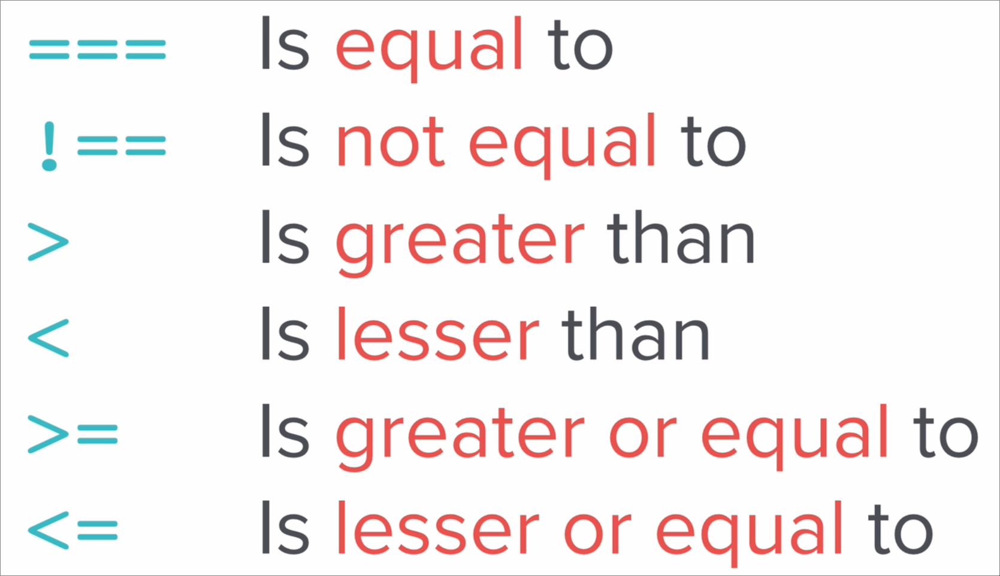

# Things to keep in mind in JS

for and while loops are the same

## Operators

### Comparators

### And, OR Operators

- AND - &&
- OR - ||

## Arrays

### Imp functions

- `.includes()`: returns either true or false
- `.push()`: to end
- `.pop()`: from end
- `.length()`
