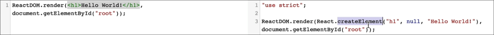

# React 

## Code Basics:

### Setting up our main.jsx(Connecting to `<div>` with id=root)

```jsx
import { StrictMode } from 'react'  
// sp component that helps to find potential problems in your react app
import { createRoot } from 'react-dom/client'  
// used to connect to your react app to actual html page in browser
// modern way to start react app since react 18
import './index.css'
import App from './App.jsx'

createRoot(document.getElementById('root')).render(
  <StrictMode>
    <App />
  </StrictMode>,
)
```

# JSX and BABEL

## JSX

- Lets you write HTML-like code directly inside your JavaScript files, especially when building React applications
- Makes your UI code more readable 
- Under the hood, JSX is conv into regular JS that react can understand and use to render HTML elements in the page

> This conv to regular JS is done using a JS compiler known as BABEL.

## Babel 

What this basically does is help us save all that time writing difficult pieces of code to generate basic HTML templates that can be added to or inside an element.

Other functionality that it provides is how this can be used as a compiler to convert the new modern js to oldschool js which can be understood by each browser.

How does it really help to convert JSX to old school JS? See below

### See it in action 


