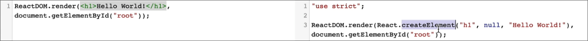

# React 

## Code Basics:

### Setting up our main.jsx(Connecting to `<div>` with id=root)

```jsx
import { StrictMode } from 'react'  
// sp component that helps to find potential problems in your react app
import { createRoot } from 'react-dom/client'  
// used to connect to your react app to actual html page in browser
// modern way to start react app since react 18
import './index.css'
import App from './App.jsx'

createRoot(document.getElementById('root')).render(
  <StrictMode>
    <App />
  </StrictMode>,
)
```

## react-router-dom

- Popular library for handling routing (navigation between pages) in React web apps

- Let's us show component based pages on the URL without reloading the page in react web app.

### Why is it required?

- React itself doesn't have built in routing.
- Keeps the UI and URL in sync, so users can navigate the app like normal website.

### Imp components

| Component	| What it does |
|----------|----------|
| `<BrowserRouter>`	| Wraps your app to enable routing | 
| `<Routes>`	| Groups all your routes | 
| `<Route>`	| Defines a path and which component to show | 
| `<Link>`	| Used for navigation (instead of `<a>`) | 
| `<Outlet>`	| Where nested routes will render (advanced) | 

### Example of how its implemented

```jsx
import { BrowserRouter, Routes, Route, Link } from "react-router-dom";
import Home from "./pages/Home";
import About from "./pages/About";

function App() {
  return (
    <BrowserRouter>
      <nav>
        <Link to="/">Home</Link>
        <Link to="/about">About</Link>
      </nav>
      <Routes>
        <Route path="/" element={<Home />} />
        <Route path="/about" element={<About />} />
      </Routes>
    </BrowserRouter>
  );
}
```

---


# JSX and BABEL

## JSX

- Lets you write HTML-like code directly inside your JavaScript files, especially when building React applications
- Makes your UI code more readable 
- Under the hood, JSX is conv into regular JS that react can understand and use to render HTML elements in the page

> This conv to regular JS is done using a JS compiler known as BABEL.

## Babel 

What this basically does is help us save all that time writing difficult pieces of code to generate basic HTML templates that can be added to or inside an element.

Other functionality that it provides is how this can be used as a compiler to convert the new modern js to oldschool js which can be understood by each browser.

How does it really help to convert JSX to old school JS? See below

### See it in action 




## JS Expressions in JSX

In jsx files we can directly insert JS expressions or variables defined.

For Example: 

```jsx
function App() {
  const name = "Keshav";

  return (
    <>
      <div className='flex flex-col justify-center items-center h-screen gap-5'>
        <h1 className='text-6xl'>{name} is learning JSX</h1>
        <h3 className='text-3xl'>Your random number is: {Math.floor(Math.random()*11)}</h3>
      </div>
    </>
  )
}

export default App
```

> One thing to note here is that **only the expressions work** not statements so if you try to insert some if-else block or other pieces of code that'll not work.

### Expressions vs Statements

Video lecture explaining how expressions are different from statements: [Click Here](https://www.youtube.com/watch?v=WVyCrI1cHi8)

