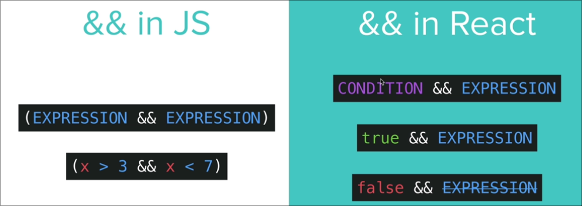

# React 

## Conditional Rendering

### Ternary Operator

Its basically if-else (which are statements) but instead it's an expression.

```js
ifCondition ? doThisIfTrue : elseDoThis;
```

**Using it in code:**

```jsx
function Auth() {
  const isLoggedIn = true;

  return (
    {isLoggedIn?<Dashboard /> : <Login />}
  )
}

export default Auth;
```
> This basically shows the dashboard if user is loggedIn but if not it shows the Login 

### AND Operator



This basicallly give us the power to render something in the expression only when the condition is true.

For example say if the time is between 9 and 17 hours then only the user will have access to the auth page.

```
{(currentTime > 9 && currentTime < 17) && <Login />}
```

This will only render the Login page when the condition is satified.


## State

Basically what we do is we track a particular variable and that particular variable defines the state of the app. 

And according to the state of the app we render things differently.


<details>
  <summary>What doesn't work in React?</summary>
  <p>
    Take an example of a basic to-do-app: 

```jsx
var isDone = false;  // This variable holds the state of the task 
var listItemClass = "some normal tailwind css"

function doneTask(){
  // As the task is marked done the css strikethrough property is applied to mark the completion of the task
  isDone = true;
  listItem = "some tailwind css code to show strikethrough";
}

function App() {
  return (
    <div>
      <button className={listItemClass} onClick={doneTask}>
        Buy Stuff
      </button>
    </div>
  )
}
```
  </p>
</details>

### Why the above example doesn't work?

In React, simply changing a regular JavaScript variable like this will NOT automatically cause your component to re-render and show the changes. React doesn't "watch" every plain variable.

**Defining state in terms of react:**

- State is data that a React component "owns" and can change over time.

- Think of it as a component's private memory.

- When a component's state changes, React will automatically re-render that component (and potentially its children) to reflect the new state.


> Enters React Hooks

## React hooks - useState()

### Destructuring in js 

Now the `useState()` returns us an array with 2 elements `[element1, element2]`

But in order to access these elements we might have to do this

```js
const state = useState(someVariable, );
// Now in order to access the first element we do 
console.log(state[0]);
// But at some point of time we might forget what this element1 might represent this is where destructuring comes into play
```

Example of destructuring an array
```js
const [red, green, blue] = [9, 12, 234];
console.log(red) // acces the first element of the array
```

### useState()

Example implementing useState():

```jsx
function Counter() {
  const [count, setCount] = useState(0);

  function increase() {
    setCount(count + 1);
  }
  function decrease() {
    setCount(count - 1);
  }

  return (
    <div className="flex justify-center text-7xl">
      {count}
    </div>
    <div className="flex gap-2">
      <button className="p-1 bg-cyan-500 text-3xl rounded-md w-12"
        onClick={decrease}>
        -
      </button>
      <button className="p-1 bg-cyan-500 text-3xl rounded-md w-12"
        onClick={increase}>
        +
      </button>
    </div>
  )
}
```

> For objects and arrays, **const means the variable will always point to the same object or array in memory**. 
> However, the contents of that object or array can still be changed (mutated).

## Event Handling 

Example of using `onClick`:

```jsx
// In a React functional component
function MyButton() {
  const handleClick = () => {
    console.log('Button was clicked!');
  };

  return (
    <button onClick={handleClick}>
      Click Me
    </button>
  );
}
```

