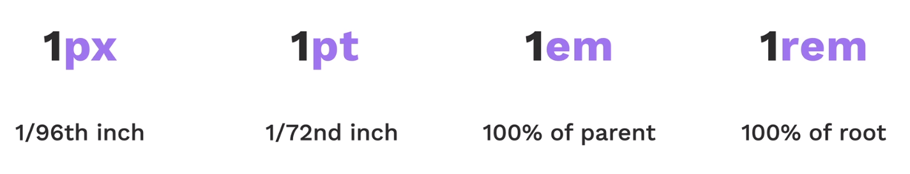

# Font Properties

## Font Size



## Font Weight

- thin
- bold
- normal etc

## Font Family

```css
h1{
    font-family: Helvetica, sans-serif
}
```
>Also note when there are spaces in name of font always use "".

# 