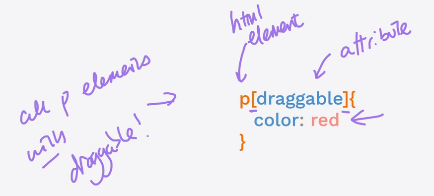

# What is CSS? 

CSS or Cascading Style Sheet is a way to add styling to your html code. There are mainly 3 ways in which you can add css to your code:

- Inline
- Internal
- External 

# Ways to add CSS

## Inline

In this styling can be directly added to that specific tag. Example:
```html
<html style="background:blue">
</html>
```

## Internal
In this way of adding css, we use `<style>Your_code_goes_here</style>`. Example:
```html
<html>
    <head>
        <style>
            html{
                background: red;
            }
        </style>
    </head>
</html>
```
> Note to add Internal CSS you want your `<style>` tag to be inside `<head>` tag

## External
This is the best way to add styling to your html code using an external file **any_name.css***
To see it's use checkout the files in **Intro to CSS**

# What are CSS Selectors?

They tell us about what we are selecting to style from the html code. For Example, in our prev example we see **html** is the CSS Selector which is used to style html tag.

So now in case of external css we can use the tag itself as CSS Selectors, but the problem with this is that it will style all the present tags in html code, therefore insteaad we take help of classes and ids. 

Classes and IDs can be different for each tag or same. For example:
```html
<h2 class="red-text">RED</h2>
<h2>Green</h2>
```

```css
.red-text{
    color: red;
}
```
Similar stuff can be done with id instead `.red-text` we have to use `#red-text`

So, whats the difference between class and id??

### Class vs ID

- As the name suggests **class** is used when you want to style **multiple elements** with same code whereas,
- **Id** is used when you want to style **specific elements**.

## Attribute Selector


> Another one is **Universal Selector** i.e represented by `*{css code goes in here}`

