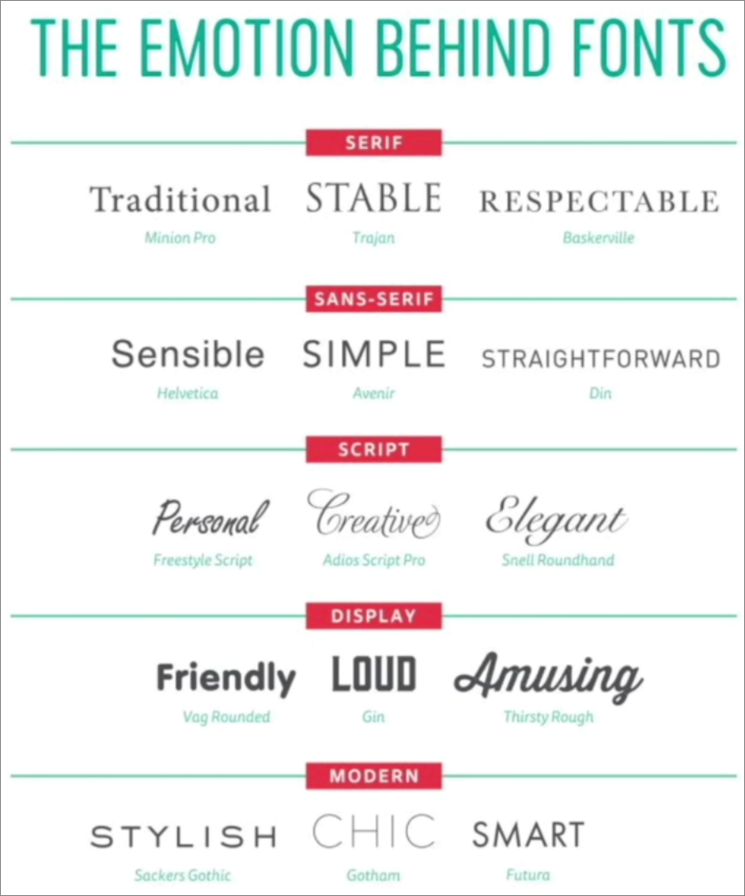
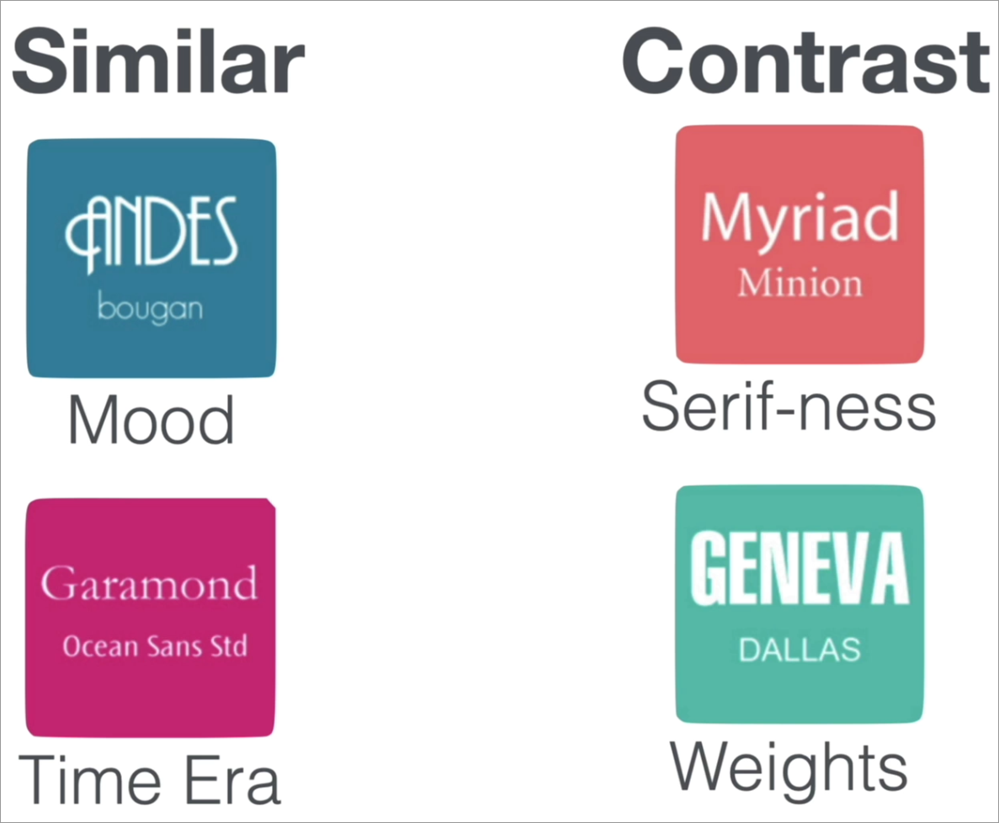
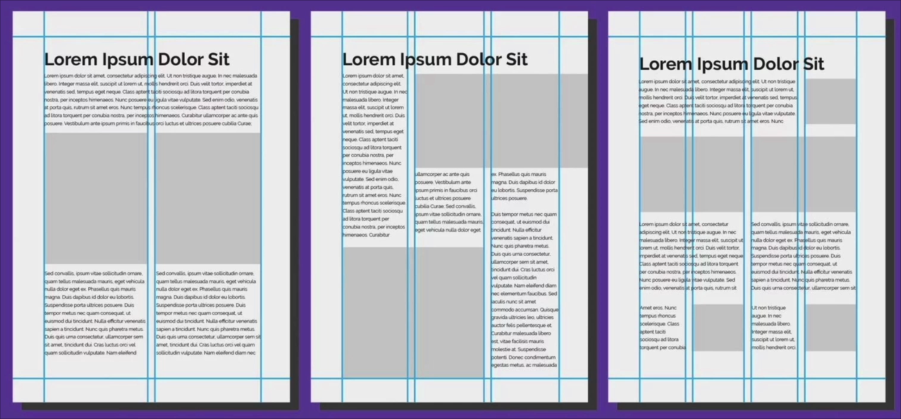

# Everything Visual to consider when building a website

## Color Theory

### Mood

The major color that you use in your website decides what mood you want to convey to a user which is using your website.

### Combining Colours

- **Analogous Colors:** When you choose a color which is right next to the primary color.
  - Reason: This usually signifies harmony 
  - Where to use: A single section(like body etc), Navigation Bar.

- **Complementary Colors:** Choosing color which are opposite to primary color in the pallete
  - Reason and Where to use: When you want things to pop of the screen.
  - Where not to use: Using them as text and it's background.

- **Triadic or Square Colors:** When you choose three or fours colors in a triangle and square respectively
  - Reason: When you want to use different colors in ur website
  - Where to use: Sometimes in a section or a whole page.
  - Many tools to get different palletes coolors or adobe colors.
  
## Typography and Choosing a Font

### Emotions behind fonts

> Some things to note are stick to 2 fonts at max like when making a poster or a particular section in your body etc. 

### Things to consider when selecting fonts

> Try avoiding fonts like **Comic Sans, Kristen, Curlz, Papyrus or Viner** as they are difficult to fit in with the mood.

## UI - Grabbing user's Attention

### Colors

Grabbing user's attention to info which is more useful can be achieved through colors by using poppy colors for imp things

### Sizes

Increasing the sizes of things where you want the user to look or grab his/her attention like buy button etc

### Alignment 

An image showing the importance of alignment to keep things clean.\
The amt of grid lines is inv proportional to how clean the interface looks like.

### White Space

Adding some white space might add the luxury in your product that you want.\
Best examples would be product advertisements.

### Audience

At the end it all comes down to what audience are you serving

## UX - Making User's Life Easy

### Simplicity

### Consistency

- Keeping the design and basic working of your website similar over different pages or section.
- Might have to change things a bit when working with different devices.
- Keeping in check the user's eye pattern usually: F and Z patterns and using them accordingly

