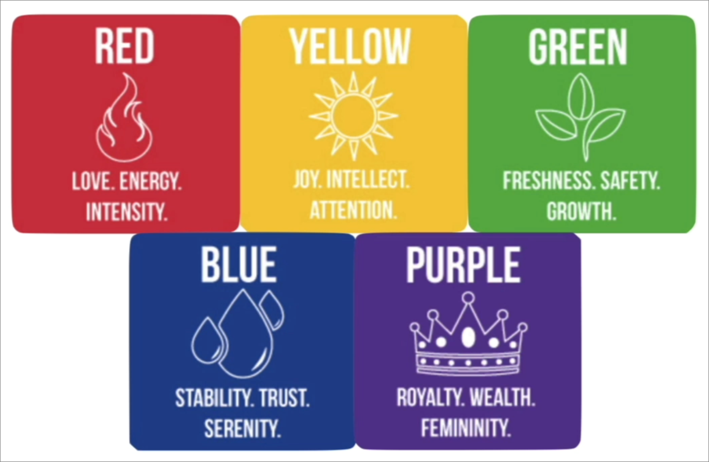

# Everything Visual to consider when building a website

## Color Theory

### Mood

The major color that you use in your website decides what mood you want to convey to a user which is using your website.

### Combining Colours

- Analogous Colors: When you choose a color which is right next to the primary color.
  - Reason: This usually signifies harmony 
  - Where to use: A single section(like body etc), Navigation Bar.

- Complementary Colors: Choosing color which are opposite to primary color in the pallete
  - Reason and Where to use: When you want things to pop of the screen.
  - Where not to use: Using them as text and it's background.

- Triadic or Square Colors: When you choose three or fours colors in a triangle and square respectively
  - Reason: When you want to use different colors in ur website
  - Where to use: Sometimes in a section or a whole page.
  - Many tools to get different palletes coolors or adobe colors.
  
